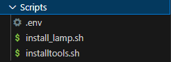

# Practica_01
## Práctica 1.
### L A M P S T A C K en UBUNTU 
Para esta práctica hay que realizar principalmente la instalación de la pila **LAMP** (Linux, Apache, MySQL, PHP.)    
El proceso se hará de forma automatizada mediante 2 scripts: uno de ellos será utilizado para la instalación de la pila **LAMP** y el otro para la implantación de ciertas herramientas webs como phpmyadmin y adicionales.

## 1. Inicial:

Primeramente empezaré configurando dentro de la una carpeta llamada *Scripts*, 2 archivos **.sh** el primero será donde se realizará lo que concierne a la instalación de la pila **LAMP** (install_lamp.sh) y el segundo para el agregado de ciertas *tools* (installtools.sh).



### 1.1 Configuraciones iniciales:

#### Mostrar comandos:
Este comando incialmente se ejecutará para mostrar los comandos por si surgiera algún error con alguno:
```
set -x
```

#### Actualización de paquetes y repositorios:

Con el siguiente comando podemos realizar la actualización de la lista de paquetes:
```
apt update
```
Por el contrario este otro trae nuevas versiones a los paquetes ya instalados:
```
apt upgrade
```
## 2. Implantación de la pila:

### 2.1 Instalación de APACHE:

Empleando este comando pasaré con la instalación de apache, y el parámetro **-y** es para que no salga la pregunta de confirmación:

```
apt install apache2 -y
```
### 2.2 Instalación de MySQL:

Empleando este comando pasaré con la instalación de MySQL, y el parámetro **-y** es para que no salga la pregunta de confirmación:
```
apt install mysql-server -y
```
### 2.3 Instalación de PHP:

Empleando este comando pasaré con la instalación de PHP, junto a 2 módulos **libapache2-mod-php** para el servidor web de apache y **php-mysql** que enlaza php junto a mysql,  y el parámetro **-y** es para que no salga la pregunta de confirmación:

```
apt install php libapache2-mod-php php-mysql -y
```
### 2.4 Archivo de configuración de apache:

En esta parte de aquí bajo la carpeta *conf*, podemos tener creado un archivo **000-default.conf** donde tengamos implementada la configuración del VirtualHost del servidor web:


y en nuestro script de automatización podemos emplear el comando **cp** para copiar hacia la ruta donde apache tiene los servidores webs **no activos**, automatizando de este modo la tarea:

```
cp ../conf/000-default.conf /etc/apache2/sites-available 
```

tras ello podemos realizar un reinicio del servicio:

```
systemctl restart apache2
```

### 2.5 Modificación de grupo y propietario:

Como incialemente puede estar perteneciendo a **root**, de la ruta **/var/www/html**, (que es la carpeta predeterminada raíz para el servidor web donde se alojan las páginas) cambiamos al **propietario** y **grupo** al de apache con el siguiente comando:

```
chown -R www-data:www-data /var/www/html
```
## 3. Configuración de las tools:
